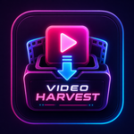

<div align="center">
  

  # VideoHarvest

  A modern, cross-platform desktop application for downloading videos and playlists using yt-dlp — without touching the command line1

  

</div>

---

## Overview

VideoHarvest is built with **Tauri 2**, **Vue 3**, **Bootstrap 5**, **SCSS**, and **Rust**. It bundles **yt-dlp** and **FFmpeg**, so you can start downloading content right after installation, with no additional setup required.

## Features

### Smart URL Detection

Paste a URL and VideoHarvest automatically:

- Validates the URL
- Detects the platform
- Detects video or playlist content
- Fetches metadata (thumbnail, title, duration, channel)

### Multiple Download Formats

**Video** — Best Quality, 4K MP4, 1080p MP4, 720p MP4

**Audio** — MP3, M4A, WAV

- Download video only, audio only, or merged formats
- Save preferred formats as defaults

### Playlist Support

- Entire playlists
- Custom ranges
- Selected videos

### Download Queue

Track downloads through their full lifecycle: Pending, Scheduled, Downloading, Completed, Failed, Cancelled.

Supported actions: Pause, Resume, Retry, Remove.

### Download Scheduler

Schedule downloads for later today, tomorrow, or on a daily recurring basis, with native desktop notifications to keep you informed.

### Download History & Logs

- Full history of previous downloads and their status
- Detailed logs: information, warnings, errors, and successful downloads

### Privacy First

- No account required
- No cloud dependency
- Fully local operation
- Open source

## Why VideoHarvest?

Most video downloaders either require command-line knowledge, depend on online services, include ads or tracking, or require manual yt-dlp installation.

VideoHarvest focuses on:

- Simplicity
- Reliability
- Performance
- Privacy
- Open-source transparency


## Installation

### Download Latest Release

Download the latest version from the [Releases](../../releases) page.

Supported packages:

- Windows (`.exe`)
- Linux (`.AppImage`, `.deb`)
- macOS (`.dmg`)

### Development Setup

**Requirements**

- Node.js 22+
- Rust (stable)
- Tauri 2

**Clone the repository**

```bash
git clone https://github.com/MasihTak/videoharvest.git
cd videoharvest
```

**Install dependencies**

```bash
npm install
```

**Start development**

```bash
npm run tauri dev
```

**Build the application**

```bash
npm run tauri build
```
---

## Contributing

Contributions are welcome.

Please read:

-   CONTRIBUTING.md
-   CODE_OF_CONDUCT.md

Before opening a pull request.


## License

This project is licensed under the MIT License.

See LICENSE for details.

## Disclaimer

VideoHarvest is a graphical interface for yt-dlp. Users are responsible for complying with the Terms of Service and copyright laws applicable in their jurisdiction. The developers of VideoHarvest do not encourage or support copyright infringement.
